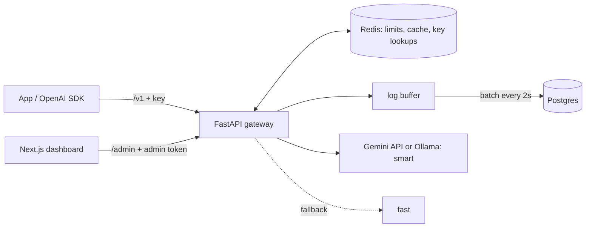

# Tollgate

**An OpenAI-compatible LLM gateway you can run on your laptop or host for a team.**
Point any OpenAI SDK at it by changing one line (`base_url`) and every request gets API keys,
rate limits, daily token quotas, exact-match caching, model fallback with a circuit breaker,
streaming, a "terse" mode that cuts output tokens, and a Linear-style dashboard with analytics.

- **Light by default:** models are served by Google's Gemini API (free key), so your machine only
  runs the gateway, Redis, Postgres and the dashboard.
- **Fully local when you want:** one flag runs open models in [Ollama](https://ollama.com) instead.
- **Self-host or share:** a single-user dashboard on localhost out of the box; add Clerk keys for
  sign-in and per-user keys when you host it for others.

## Quickstart

Requires Docker. Get a free Gemini API key at https://aistudio.google.com/apikey.

```bash
git clone https://github.com/sumitsingh3072/tollgate.git
cd tollgate
cp .env.example .env          # paste your key into GEMINI_API_KEY
docker compose up -d
```

Open **http://localhost:3000** → **Open dashboard** → **Keys** → **New key**, then try it in the
**Playground**, or from code:

```python
from openai import OpenAI

client = OpenAI(base_url="http://localhost:8000/v1", api_key="tg_live_...")
reply = client.chat.completions.create(model="fast", messages=[{"role": "user", "content": "Hi!"}])
print(reply.choices[0].message.content)
```

Everything else is automatic: the database schema, the admin token shared by gateway and
dashboard, and the dashboard itself (no sign-in, bound to localhost). The sidebar shows whether
Redis, the database and the model provider are ready.

## Model aliases

The `model` field picks an alias; Tollgate maps it to real models and falls back on failure.

| Alias           | Gemini API (default)                     | Ollama (local)            |
|-----------------|------------------------------------------|---------------------------|
| `fast`          | gemma-4-26b-a4b-it                       | gemma3:1b                 |
| `smart`         | gemma-4-31b-it → gemma-4-26b-a4b-it      | gemma3:4b → gemma3:1b     |
| `smart-terse`   | like smart, with a terse system prompt   | like smart, terse         |
| `demo-failover` | always-500 mock → fast                   | always-500 mock → fast    |

Responses carry `x-tollgate-model`, `x-tollgate-cache` (hit/miss/bypass) and
`x-tollgate-fallback` headers, plus OpenAI-style `x-ratelimit-*` headers.

## Run models locally (optional)

Needs about 8 GB of free RAM; the first start downloads ~4 GB of models into a Docker volume.

```bash
echo "UPSTREAM_PROVIDER=ollama" >> .env
docker compose --profile ollama up -d
docker compose logs -f ollama-init     # watch the download
```

Pick any [Ollama](https://ollama.com/library) tags with `OLLAMA_FAST_MODEL` / `OLLAMA_SMART_MODEL`
(for example `gemma4:e4b`). On Apple Silicon, Docker can't use the GPU: install Ollama natively and
set `OLLAMA_BASE_URL=http://host.docker.internal:11434/v1` instead. On Linux with an NVIDIA GPU, add
`-f compose.gpu.yml`.

## Hosting it for others (optional)

Each concern switches independently in `.env`:

| Want                            | Set                                                              |
|---------------------------------|------------------------------------------------------------------|
| Sign-in and per-user keys       | `NEXT_PUBLIC_CLERK_PUBLISHABLE_KEY`, `CLERK_SECRET_KEY` ([Clerk](https://dashboard.clerk.com)) |
| Reachable from other machines   | `BIND_ADDRESS=0.0.0.0`, `NEXT_PUBLIC_GATEWAY_URL`, `CORS_ORIGINS` |
| Managed Postgres (e.g. Neon)    | `DATABASE_URL` (paste the connection string as-is)               |
| A fixed admin token             | `ADMIN_TOKEN` (otherwise generated on first start)               |

> **Warning:** without Clerk the dashboard has no sign-in. Only set `BIND_ADDRESS=0.0.0.0` with
> Clerk enabled, behind TLS.

With Clerk, each user manages only their own keys, logs and usage, within per-user caps
(`USER_MAX_KEYS`, `USER_MAX_RPM`, `USER_MAX_DAILY_TOKENS`) that protect your Gemini quota.

## How it works



Nothing slow sits on the request path: key lookups hit Redis first, both limits are checked in one
Redis round trip, and logs reach Postgres in batches every 2 seconds.

| Port  | Service                                   |
|-------|-------------------------------------------|
| 3000  | Landing page + dashboard (`/dashboard`)   |
| 8000  | Gateway: `/v1` (OpenAI API), `/admin`, `/health`, `/docs` |

More: [architecture](docs/architecture.md) · [plan](docs/plan.md) · [phases](docs/phase.md) ·
[development setup](CLAUDE.md#run).
