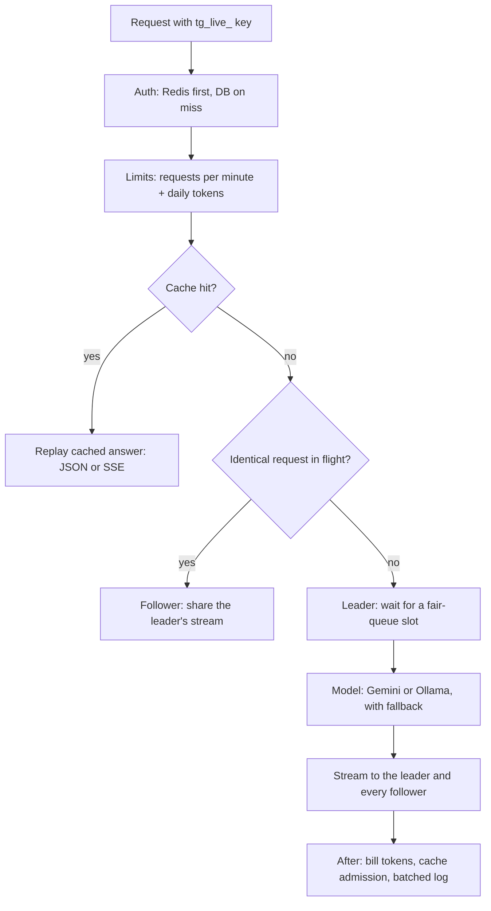

# Tollgate

**Every token pays the toll.** Tollgate is a self-hostable, OpenAI-compatible LLM gateway. Point any
OpenAI SDK at it by changing one line (`base_url`) and every request gets API keys, rate limits,
daily token quotas, a cache that doesn't bloat, request coalescing, fair queuing between keys, model
fallback with a circuit breaker, streaming, and a dashboard that shows all of it working.

- **Avoids repeated work:** an exact-match cache with second-sight admission, plus coalescing of
  identical in-flight requests (50 identical requests → 1 model call in our benchmark).
- **Shares capacity fairly:** a Virtual Token Counter scheduler (OSDI 2024) decides who goes next, so
  one script can't make everyone wait (a light user's median wait under load: 8.0 s → 0.1 s).
- **Proves it:** Prometheus metrics in OpenTelemetry GenAI naming, per-request cost tags, time to first
  token, and dashboard pages for cache efficiency and fairness.
- **Runs anywhere:** Google's Gemini API by default (light on your machine), fully local models with
  Ollama on demand; a single-user dashboard on localhost, or Clerk accounts when you host it for others.

---

## Contents

[Quickstart](#quickstart) · [How a request flows](#how-a-request-flows) · [Features](#features) ·
[Using the API](#using-the-api) · [Dashboard](#dashboard) · [Configuration](#configuration) ·
[Deployment](#deployment) · [Observability](#observability) · [Benchmarks](#benchmarks) ·
[Security](#security) · [Development](#development) · [Troubleshooting](#troubleshooting)

---

## Quickstart

Requirements: Docker (with Compose v2.24+). A free Gemini API key from
https://aistudio.google.com/apikey.

```bash
git clone https://github.com/sumitsingh3072/tollgate.git
cd tollgate
cp .env.example .env            # paste your key into GEMINI_API_KEY
docker compose up -d
```

Open **http://localhost:3000** → **Open dashboard** → **Keys** → **New key**, then try it in the
**Playground** or from code:

```python
from openai import OpenAI

client = OpenAI(base_url="http://localhost:8000/v1", api_key="tg_live_...")
reply = client.chat.completions.create(
    model="fast",
    messages=[{"role": "user", "content": "Hello!"}],
)
print(reply.choices[0].message.content)
```

Everything else is automatic: the database schema and migrations, an admin token shared by the
gateway and dashboard, a dedicated cache Redis, and a dashboard without sign-in bound to localhost.

| Port | Service |
|------|---------|
| 3000 | Landing page and dashboard (`/dashboard`) |
| 8000 | Gateway: `/v1` (OpenAI API), `/admin`, `/health`, `/metrics`, `/docs` |

---

## How a request flows



Cache hits never touch the queue or the model; coalescing followers never queue; only genuinely new
work waits for a model slot. Nothing slow sits on the request path: keys are looked up in Redis, both
limits are one Redis round trip, and logs reach Postgres in batches every 2 seconds.

---

## Features

### Gateway core
- **OpenAI-compatible** `/v1/chat/completions` (streaming and non-streaming) and `/v1/models`;
  unknown OpenAI fields pass through.
- **API keys** (`tg_live_` + 32 chars). Only a SHA-256 hash is stored; revoking is immediate.
- **Rate limits and quotas** per key: requests per minute and a daily token budget (UTC), with
  OpenAI-style `x-ratelimit-*` headers and `Retry-After` on 429.
- **Model aliases with fallback**: if a model errors, times out, is rate-limited or exceeds
  `FALLBACK_TIMEOUT`, the next model answers. A circuit breaker skips a failing model for 30 s.
- **Terse mode**: `*-terse` aliases ask for the shortest correct answer (85% fewer output tokens in
  one test).

### Cache that doesn't bloat
Most prompts never repeat, and a naive cache fills with them. Tollgate layers six defenses:
1. **Eligibility**: deterministic requests only (`temperature: 0`, no tools, `n = 1`); only complete
   answers (`finish_reason: "stop"`, no tool calls, ≤ 16 KB).
2. **Canonical, scoped key**: `sha256(scope | alias | canonical request)` with normalized whitespace.
3. **Admission on second sight** (simplified TinyLFU): the first sighting stores only a ~100-byte
   marker; the answer is cached when the same request returns within an hour.
4. **Bounded memory**: a dedicated Redis with `maxmemory` and `allkeys-lfu`, so cache pressure can
   never evict rate-limit counters or quotas (those live in a `noeviction` Redis).
5. **Scopes**: private per key by default. The `faq` alias shows the opt-in **shared** pool, with a
   per-key insert budget and cache headers hidden from callers.
6. **TTL** per route (24 h default).

Streamed answers are cached too and replayed as a fast SSE stream. Every response says what happened
in `x-tollgate-cache`: `hit`, `miss` (stored), `admission_rejected` (seen once), `ineligible`, `bypass`.

### Request coalescing
Identical cache-eligible requests that arrive together share one upstream call: the first is the
**leader**, the rest **follow** and receive the same stream, including late joiners. The upstream call
runs in its own task, so a disconnecting leader doesn't cut off followers; it is cancelled only when
the last listener leaves. Each key is billed for what it received. Header: `x-tollgate-coalesce`.

### Fair queuing (VTC)
The gateway caps in-flight requests per model (`UPSTREAM_MAX_PARALLEL`) so the provider's own FIFO
queue stays empty, and orders waiting requests by a **Virtual Token Counter** per key (input + 2 ×
output tokens, charged while streaming). The key that has received the least goes next; a key returning
from idle is lifted to the active minimum so it can't bank idle time. Backpressure: at most 20 queued
requests per key and 30 s of waiting, then 429 with `Retry-After`. Header: `x-tollgate-queue-wait-ms`.

### Accounts (optional)
Without Clerk keys the dashboard is a single-user operator console on localhost. With Clerk, each user
signs in (Google, GitHub, email) and sees only their own keys, logs and usage, within per-user caps.

---

## Using the API

| Alias | Gemini API (default) | Ollama (local) |
|-------|----------------------|----------------|
| `fast` | gemma-4-26b-a4b-it | gemma3:1b |
| `smart` | gemma-4-31b-it → gemma-4-26b-a4b-it | gemma3:4b → gemma3:1b |
| `smart-terse` | like `smart`, terse prompt | like `smart`, terse prompt |
| `faq` | `fast` with a **shared** cache pool | same |
| `demo-failover` | always-500 mock → `fast` | same |

Response headers:

| Header | Meaning |
|--------|---------|
| `x-tollgate-model` | The model that actually answered |
| `x-tollgate-fallback` | `true` if a fallback model answered |
| `x-tollgate-cache` | `hit` · `miss` · `admission_rejected` · `ineligible` · `bypass` (hidden for shared scope) |
| `x-tollgate-coalesce` | `leader` · `follower` · `none` (hidden for shared scope) |
| `x-tollgate-queue-wait-ms` | Time spent waiting for a model slot |
| `x-ratelimit-*`, `retry-after` | Remaining requests and tokens; when to retry after 429 |
| `x-request-id` | Correlates the response with gateway logs |

Request header `x-tollgate-tags: feature=search,team=growth` attaches cost-attribution tags (up to 10
`key=value` pairs) to the request log.

Errors use the OpenAI envelope `{"error": {"type", "message"}}`. Notable types: `rate_limit`,
`quota_exceeded`, `queue_full`, `queue_timeout`, `upstream_error`, `upstream_timeout`,
`model_not_found`, `service_unavailable`.

Admin API (Bearer `ADMIN_TOKEN`; the dashboard calls it server-side):

| Method | Path | Purpose |
|--------|------|---------|
| POST / GET / DELETE | `/admin/keys` | Create (full key returned once), list, revoke |
| GET | `/admin/stats?hours=` | Totals, trends, latency and TTFT percentiles, usage by key/alias/model |
| GET | `/admin/logs` | Keyset-paginated logs; filter by key, alias, status, cache status, coalesce role, tag |
| GET | `/admin/cache/stats` | Hit rate, memory vs limit, evictions, admission rejections, hits per MB |
| GET | `/admin/coalesce/stats` | Calls saved, share rate, largest fan-out |
| GET | `/admin/fairness` | Tokens and share per key, queue waits, live depth, VTC counters, Jain's index |
| GET | `/admin/activity` | Daily totals for the activity heatmap |
| GET | `/admin/aliases`, `/admin/me` | Aliases with chains; caller scope and caps |

Interactive reference: http://localhost:8000/docs (disabled when `ENVIRONMENT=production`).

---

## Dashboard

Overview (trends, activity heatmap, status mix, latency distribution, TTFT, model calls saved),
Keys, Logs (with cache, coalescing, queue and tag details), **Cache**, **Fairness** (live), and a
Playground that shows the gateway headers for every reply. Linear-style UI in light and dark, ⌘K
command menu.

---

## Configuration

Copy `.env.example` to `.env`. Only `GEMINI_API_KEY` is needed for the default setup.

| Variable | Default | Purpose |
|----------|---------|---------|
| `GEMINI_API_KEY` | (empty) | Gemini API key (default provider) |
| `UPSTREAM_PROVIDER` | `gemini` | `gemini` or `ollama` |
| `GEMINI_FAST_MODEL` / `GEMINI_SMART_MODEL` | gemma-4-26b-a4b-it / gemma-4-31b-it | Hosted models |
| `GEMINI_THINKING_LEVEL` | `minimal` | Keeps Gemma's `<thought>` text out of replies |
| `OLLAMA_FAST_MODEL` / `OLLAMA_SMART_MODEL` | gemma3:1b / gemma3:4b | Local models |
| `OLLAMA_BASE_URL` | compose: `http://ollama:11434/v1` | e.g. a native Ollama on the host |
| `DATABASE_URL` | bundled Postgres | Any Postgres, e.g. Neon (paste as-is) |
| `ADMIN_TOKEN` | generated on first start | Pin it to call `/admin` yourself |
| `NEXT_PUBLIC_CLERK_PUBLISHABLE_KEY`, `CLERK_SECRET_KEY` | (empty) | Enable accounts |
| `USER_MAX_KEYS` / `USER_MAX_RPM` / `USER_MAX_DAILY_TOKENS` | 5 / 120 / 500000 | Caps for signed-in users |
| `GATEWAY_BIND_ADDRESS` | `127.0.0.1` | `0.0.0.0` to let other machines call the API |
| `DASHBOARD_BIND_ADDRESS` | `127.0.0.1` | `0.0.0.0` to expose the dashboard (with Clerk) |
| `NEXT_PUBLIC_GATEWAY_URL`, `CORS_ORIGINS` | localhost | Public URLs for a remote deployment |
| `UPSTREAM_TIMEOUT` / `FALLBACK_TIMEOUT` | 120 / 30 s | Last-attempt timeout / fallback deadline |
| `CACHE_TTL` / `CACHE_MAX_ENTRY_BYTES` / `CACHE_SEEN_TTL` | 86400 / 16384 / 3600 | Cache behavior |
| `CACHE_MAX_MEMORY` | `256mb` | Memory cap of the cache Redis |
| `CACHE_INSERT_BUDGET_PER_MIN` | 30 | Shared scope: new entries per key per minute |
| `COALESCING_ENABLED` | `true` | Share identical in-flight requests |
| `UPSTREAM_MAX_PARALLEL` | 4 | In-flight requests per model (Ollama follows it) |
| `FAIR_QUEUE_MODE` | `fair` | `fair`, `fifo`, `off` (the last two for benchmarks) |
| `FAIR_MAX_QUEUE_PER_KEY` / `FAIR_MAX_WAIT_S` | 20 / 30 | Backpressure |
| `LOG_FORMAT` / `LOG_LEVEL` / `ENVIRONMENT` | json / INFO / development | Logging |

---

## Deployment

**Local models (Ollama).** Needs ~8 GB free RAM; the first start downloads ~4 GB into a volume.

```bash
echo "UPSTREAM_PROVIDER=ollama" >> .env
docker compose --profile ollama up -d
docker compose logs -f ollama-init      # watch the model download
```

On Apple Silicon, Docker can't use the GPU: run Ollama natively and set
`OLLAMA_BASE_URL=http://host.docker.internal:11434/v1`. With an NVIDIA GPU, add `-f compose.gpu.yml`.

**Serving the API to other machines** (dashboard stays private): set `GATEWAY_BIND_ADDRESS=0.0.0.0`
and put TLS in front of port 8000.

**Hosting the dashboard for others.** Set the Clerk keys, `DASHBOARD_BIND_ADDRESS=0.0.0.0`,
`NEXT_PUBLIC_GATEWAY_URL` and `CORS_ORIGINS` to your public URLs, then **rebuild**:
`docker compose up -d --build` (the Clerk publishable key is compiled into the dashboard; it refuses
to serve until rebuilt). Put TLS in front (Caddy, nginx) and optionally point `DATABASE_URL` at a
managed Postgres. Run the gateway as a **single process**: coalescing and the fair queue are per
process.

**Operations.** `/health/live` is the container liveness probe (no dependency checks); `/health` is
readiness (Redis, database, provider) and drives the sidebar status. Schema changes are additive and
applied automatically on startup. The state Redis persists (AOF), so daily quotas survive restarts;
the cache Redis is deliberately ephemeral. `docker compose down` keeps data in volumes.

---

## Observability

`GET /metrics` (Bearer `ADMIN_TOKEN`) exposes Prometheus metrics:

| Metric | Type |
|--------|------|
| `gen_ai_client_token_usage{token_type}` | histogram |
| `gen_ai_client_operation_duration_seconds` | histogram |
| `gen_ai_server_time_to_first_token_seconds` | histogram |
| `tollgate_cache_requests_total{status}`, `tollgate_cache_admission_rejected_total` | counters |
| `tollgate_coalesced_requests_total{role}` | counter |
| `tollgate_queue_depth{key_prefix}`, `tollgate_queue_wait_seconds` | gauge, histogram |

```yaml
# prometheus.yml
scrape_configs:
  - job_name: tollgate
    static_configs: [{ targets: ["gateway-host:8000"] }]
    authorization: { credentials: "<ADMIN_TOKEN>" }
```

Logs are JSON lines with an `x-request-id` on every line; every request is also stored in
`request_logs` with cache status, coalesce role, queue wait, TTFT and tags.

---

## Benchmarks

Measured with `backend/bench` against a simulated model (full method and results, including what
didn't help, in [docs/benchmarks.md](docs/benchmarks.md)):

| What | Result |
|------|--------|
| 50 identical concurrent requests | 50 model calls / 6.61 s → **1 call / 0.56 s** with coalescing |
| Light user behind a 20-request heavy user, 1 model slot | median wait **8.03 s → 0.10 s** with the fair queue |
| 5,000 requests, Zipf + 40% one-off, 2 MB cache | same hit rate, **277 vs 607 entries, 7x fewer evictions** |

---

## Security

- API keys are random 190-bit secrets; only SHA-256 hashes are stored. Unknown keys are cached as
  invalid briefly so junk keys can't hammer the database.
- `ADMIN_TOKEN` never reaches a browser: the dashboard calls `/admin` from its server. With Clerk,
  the dashboard identifies the user with `X-Tollgate-User`, which the gateway trusts only together
  with `ADMIN_TOKEN`.
- **Without Clerk the dashboard has no sign-in**, so it only answers to `localhost` / `127.0.0.1`
  (which also blocks DNS-rebinding attacks) and is bound to `127.0.0.1`. The API and dashboard bind
  addresses are separate, so exposing the API never exposes the dashboard.
- If Clerk keys are present at runtime but the dashboard was built without them, it refuses to serve
  rather than fall back to the open operator view.
- The admin token is generated on first start; the gateway refuses the public default in production
  and fails loudly if its token file is missing.
- The shared cache pool is opt-in: response timing can still reveal that someone asked the same thing.
- `/metrics` and `/admin` require `ADMIN_TOKEN`; `/docs` is disabled in production.

---

## Development

```bash
docker compose -f docker-compose.yml -f compose.dev.yml up -d redis redis-cache postgres mock-upstream
cd backend && uv venv -p 3.12 .venv && uv pip install -r requirements-dev.txt
.venv/bin/uvicorn app.main:app --reload --port 8000
.venv/bin/pytest && .venv/bin/ruff check . && .venv/bin/ruff format --check .
cd ../frontend && cp .env.example .env.local && pnpm install && pnpm dev
pnpm lint && pnpm build
```

Project layout and design notes: [docs/architecture.md](docs/architecture.md) ·
[docs/plan.md](docs/plan.md) · [docs/phase.md](docs/phase.md) · [CLAUDE.md](CLAUDE.md).

---

## Troubleshooting

| Symptom | Fix |
|---------|-----|
| Sidebar says "GEMINI_API_KEY not set" | Add the key to `.env`, then `docker compose up -d` |
| Port 3000/8000 already in use | Set `FRONTEND_PORT` / `BACKEND_PORT` in `.env` |
| 429 `queue_full` / `queue_timeout` | The model is saturated: raise `UPSTREAM_MAX_PARALLEL` or slow the client |
| `smart` is slow or falls back to `fast` | The large model is busy; adjust `FALLBACK_TIMEOUT` |
| Playground "Cannot reach the gateway" | The dashboard's origin must be in `CORS_ORIGINS` |
| Ollama answers slowly on a Mac | Run Ollama natively (see Deployment) |
