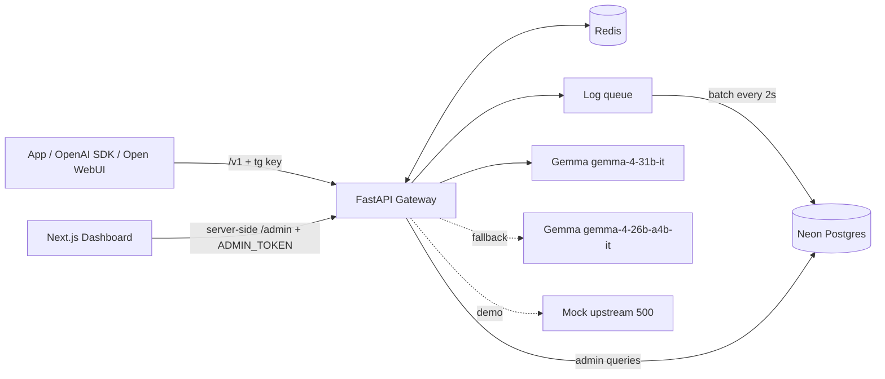

# Tollgate Lite: Architecture

## Deployment modes
Same images, chosen by .env (all optional):
| Concern  | Default                               | Optional                                 |
|----------|---------------------------------------|------------------------------------------|
| Models   | Gemini API (GEMINI_API_KEY)           | Ollama: UPSTREAM_PROVIDER=ollama + `--profile ollama` |
| Database | bundled postgres:17                   | Neon or any Postgres (DATABASE_URL)      |
| Accounts | none: dashboard is the operator       | Clerk (publishable + secret key)         |
| Network  | ports bound to 127.0.0.1              | BIND_ADDRESS=0.0.0.0 behind TLS          |
The admin token is generated on first start (secrets-init) unless ADMIN_TOKEN is set.

## Components
- Gateway (FastAPI, :8000): /v1 data plane + /admin control plane.
- Redis (:6379): rate-limit counters, token quotas, response cache, cached key
  lookups.
- Neon Postgres: api_keys, request_logs. (Local dev: postgres:17 via the
  `localdb` compose profile.)
- Ollama (:11434, internal, `ollama` compose profile): optional local models (default
  gemma3:1b / gemma3:4b), pulled by the one-shot ollama-init service into a volume.
- Gemini API (generativelanguage.googleapis.com/v1beta/openai): hosted alternative
  serving the Gemma 4 upstream models,
  OpenAI-compatible, Bearer GEMINI_API_KEY. The key lives only in the gateway.
- Mock upstream (:9000): always returns 500, used to demo failover.
- Dashboard (Next.js, :3000): Server Components read /admin server-side and
  Server Actions mutate it (ADMIN_TOKEN never reaches the browser); pages stream
  behind Suspense skeletons. Playground calls /v1 directly from the browser with
  a pasted Tollgate key.



## Cross-cutting
- Request context middleware (pure ASGI, streaming-safe): accepts a safe
  incoming x-request-id or generates one, echoes it in the response, attaches it
  to every log record, writes one access log line (method, path, status,
  latency_ms). /health is excluded from access logs.
- Errors: every failure, including 404/422/500, returns the OpenAI envelope
  {"error":{"type","message"}}. Unhandled exceptions are logged with a stack
  trace and masked as server_error with the request id.
- Logging: LOG_FORMAT=console (dev) or json (containers). Secrets (Gemini key,
  admin token) are SecretStr and never logged; Upstream.api_key is excluded
  from repr.
- Config: pydantic-settings reads the repo-root .env (shared with compose),
  then backend/.env. Aliases are built once at startup into app.state.aliases.

## Accounts (Clerk)
- The dashboard signs users in with Clerk. Public: / (landing), /sign-in, /sign-up.
  Signed-in: /dashboard/*. Access is checked where data is read: (app)/layout calls
  auth.protect() and every admin call in lib/server/gateway.ts requires a user.
- The dashboard server calls /admin with ADMIN_TOKEN plus X-Tollgate-User: <Clerk
  user id>. The gateway trusts the header only alongside ADMIN_TOKEN (which never
  reaches a browser) and scopes keys, logs, stats and activity to that owner.
  ADMIN_TOKEN without the header is the operator view of everything.
- Self-serve caps (USER_MAX_KEYS / USER_MAX_RPM / USER_MAX_DAILY_TOKENS) protect the
  shared GEMINI_API_KEY; GET /admin/me reports them to the dashboard.

## Request pipeline
auth -> limits -> cache lookup -> coalescing -> fair queue -> model -> stream back -> after-response.
Cache hits never reach the queue or the model; coalescing followers attach to an in-flight call and
never queue; only leaders of cache misses take a model slot. Every upstream call runs in a Flight task
(app/core/coalesce.py) independent of client connections; the fair queue (app/core/fair_queue.py)
caps in-flight requests per model and orders waiters by a Virtual Token Counter per key.

## Request flow: POST /v1/chat/completions
1. Auth: hash the Bearer key (SHA-256). Look it up in Redis (key:{hash}), else
   Neon, then cache it for 60s. Unknown or revoked -> 401.
2. Limits: RPM counter rl:{key_id}:{minute} (INCR + EXPIRE). Daily tokens
   tok:{key_id}:{YYYY-MM-DD} (UTC). Both in one pipelined round trip. Over either
   -> 429 with JSON {"error":{"type":"rate_limit"|"quota_exceeded","message":...}}
   and Retry-After. Success responses carry x-ratelimit-{limit,remaining}-{requests,tokens}.
   Unknown/revoked keys are cached as invalid for KEY_CACHE_TTL too. Redis or DB
   unavailable -> 503 service_unavailable.
3. Resolve alias -> chain of upstreams; terse aliases prepend the terse system
   prompt.
4. Cache (only temperature==0 and stream false): key = sha256 of the canonical
   request body (alias, messages, temperature, max_tokens, tools, ...; stream and
   user ignored). Hit -> return in a few ms, header x-tollgate-cache: hit. Hits
   still count toward RPM but not the token quota.
5. Forward: try each upstream in order (POST {base_url}/chat/completions with
   Authorization: Bearer {upstream.api_key}, model rewritten to the upstream id,
   upstream.default_params deep-merged under the client body; for Gemma this
   sets extra_body.google.thinking_config.thinking_level=minimal). The client's
   Authorization header is never forwarded. Streams check the upstream status
   before sending headers, so failures return a normal JSON error., skipping any with an open circuit
   breaker. On connect error, timeout, or 5xx -> record failure, try next.
   Entries that have a fallback get FALLBACK_TIMEOUT (30s; time to first byte for
   streams); the last entry gets the full UPSTREAM_TIMEOUT.
   Upstream 429 also falls back (separate per-model quota); other 4xx return
   immediately. Breaker: 3 consecutive failures -> open for 30s, then one
   half-open trial. Breakers are in-process (app.state.breakers). If every
   upstream is open, all are tried anyway. Streams can fall back until the first
   byte because the upstream status is checked before headers are sent.
6. Stream: relay SSE chunks unchanged via StreamingResponse. Request
   stream_options include_usage when supported; otherwise estimate tokens.
7. After: INCRBY usage.total_tokens (Gemma counts thinking tokens only in the total;
   chars/4 estimate if usage is missing; streams parse usage from SSE and record it
   from a background task so client disconnects still count), store cache entry
   (TTL 1h), enqueue log event.
   Headers: x-tollgate-model, x-tollgate-cache, x-tollgate-fallback.

## Endpoints
| Method | Path                  | Purpose                                 |
|--------|-----------------------|-----------------------------------------|
| POST   | /v1/chat/completions  | OpenAI-compatible chat, stream/non-stream|
| GET    | /v1/models            | Aliases available                        |
| GET    | /health               | Readiness: redis/db + provider usable    |
| GET    | /health/live          | Liveness (no dependency checks)          |
| POST   | /admin/keys           | Create key (full key returned once)      |
| GET    | /admin/keys           | List keys (prefix only)                  |
| DELETE | /admin/keys/{id}      | Revoke (also deletes Redis cache entry)  |
| GET    | /admin/stats          | Totals, tokens by key, cache rate, p50/p95|
| GET    | /admin/logs           | Paginated logs, filters: key, alias, status|
| GET    | /admin/aliases        | Aliases with their model chains          |
| GET    | /admin/activity       | Daily totals for the activity heatmap    |
| GET    | /admin/me             | Caller's scope, active keys and caps     |
| GET    | /admin/coalesce/stats | Calls saved, share rate, largest fan-out |
| GET    | /admin/fairness       | Per-key tokens, waits, VTC, Jain's index |
| GET    | /metrics              | Prometheus (admin token)                 |

## Data model (Neon)
api_keys: id uuid pk, name text, key_hash text unique, prefix text, rpm int,
daily_token_quota int, created_at timestamptz, revoked_at timestamptz null,
owner_id text null (Clerk user id; added by an idempotent startup migration)

request_logs: id bigserial pk, ts timestamptz, key_id uuid fk, alias text,
model_used text, in_tokens int, out_tokens int, latency_ms int, status int,
cache_hit bool, fallback_used bool
Indexes: (ts), (key_id, ts)

Percentiles via SQL: percentile_cont(0.95) WITHIN GROUP (ORDER BY latency_ms).
ts is set by the gateway when the request starts (not at insert time). out_tokens =
total_tokens - prompt_tokens, so in + out equals what the quota was charged. Cache
hits are logged with 0 tokens. /admin/logs pages newest-first by id (keyset cursor).
/admin/stats runs its aggregates concurrently (one session each) and returns the
current and previous window, a zero-filled time series (1h/3h/6h/12h/1d buckets,
<= 48 points), status mix and a latency histogram of upstream-served requests.
Tables created with metadata.create_all on startup (no Alembic).

## Folder structure
```
tollgate/
├── backend/
│   ├── app/
│   │   ├── main.py            # app factory, lifespan (httpx, redis, db, log flusher), /health
│   │   ├── config.py          # Settings + build_aliases (Gemma chains)
│   │   ├── deps.py            # auth + admin-token dependencies
│   │   ├── errors.py          # GatewayError + OpenAI-style error handlers
│   │   ├── schemas.py         # ChatCompletionRequest (extra fields pass through), model list
│   │   ├── logging_setup.py   # console/JSON formatters, request-id contextvar
│   │   ├── middleware.py      # request id + access log (pure ASGI)
│   │   ├── api/
│   │   │   ├── v1.py
│   │   │   └── admin.py
│   │   ├── core/
│   │   │   ├── keys.py        # key format, SHA-256, Redis key cache (incl. negative entries)
│   │   │   ├── usage.py       # usage from JSON/SSE, chars/4 estimate
│   │   │   ├── tasks.py       # fire-and-forget tasks (survive client disconnect), drained on shutdown
│   │   │   ├── proxy.py       # forwarding + SSE streaming
│   │   │   ├── fallback.py    # chain + circuit breaker
│   │   │   ├── cache.py
│   │   │   ├── limits.py
│   │   │   └── terse.py
│   │   ├── db/
│   │   │   ├── session.py
│   │   │   ├── models.py
│   │   │   ├── analytics.py   # stats aggregates: totals, histogram, status mix, time series
│   │   │   └── queries.py
│   │   └── logging_queue.py   # RequestRecord -> LogEvent buffer, 2s batch flusher
│   ├── tests/
│   ├── mock_upstream.py
│   ├── scripts/smoke_openai.py  # OpenAI SDK end-to-end check against a running gateway
│   ├── requirements.txt       # runtime pins
│   ├── requirements-dev.txt   # + pytest, respx, ruff
│   ├── pyproject.toml         # ruff + pytest config
│   └── Dockerfile             # multi-stage, non-root; also runs mock_upstream
├── frontend/
│   ├── app/
│   │   ├── layout.tsx               # theme script, SidebarProvider, inset shell
│   │   ├── actions.ts               # Server Actions: createKey, revokeKey (+ refresh())
│   │   ├── error.tsx, not-found.tsx
│   │   ├── page.tsx + _components/overview.tsx      # Overview (stats, charts)
│   │   ├── keys/ (page.tsx, _components/: keys-table, create-key-dialog, revoke-key-button)
│   │   ├── logs/ (page.tsx, _components/: logs-table, log-filters)
│   │   ├── playground/ (page.tsx, _components/: playground, use-chat)
│   │   └── api/health/route.ts      # gateway status for the sidebar
│   ├── components/
│   │   ├── ui/                      # shadcn (base-nova)
│   │   └── app-sidebar, site-header, command-menu, page-header, stat-card, usage-chart,
│   │       local-time, copy-button, window-select, refresh-button, error-state,
│   │       theme-toggle, theme-script, gateway-status
│   ├── hooks/ (use-mobile.ts, use-session-storage.ts)
│   ├── lib/ (api.ts, format.ts, nav.ts, search-params.ts, sse.ts, theme*.ts, types.ts,
│   │         server/gateway.ts)
│   ├── Dockerfile                   # standalone output, non-root
│   └── .env.example
├── docs/ (plan.md, architecture.md, phase.md)
├── .env.example               # all optional; compose + local backend read it
├── docker-compose.yml         # zero-config stack: secrets-init, redis, postgres, ollama(+init),
│                              #   mock-upstream, backend, frontend (ollama: opt-in profile)
├── compose.dev.yml            # publish infra ports for host development
├── compose.gpu.yml            # NVIDIA GPU for Ollama
├── CLAUDE.md
└── README.md
```
