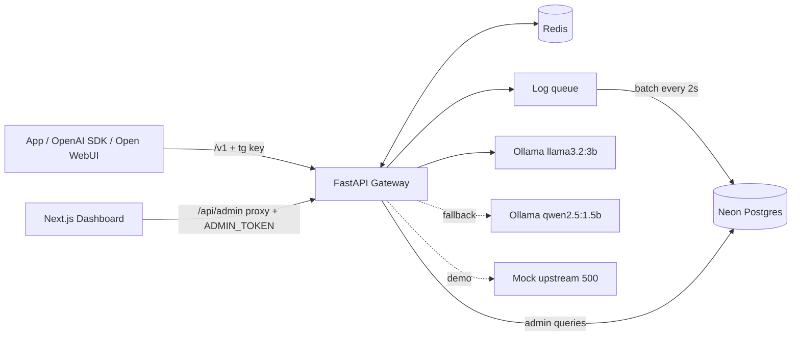

# Tollgate Lite: Architecture

## Components
- Gateway (FastAPI, :8000): /v1 data plane + /admin control plane.
- Redis (:6379): rate-limit counters, token quotas, response cache, cached key
  lookups.
- Neon Postgres: api_keys, request_logs.
- Ollama (:11434): upstream models.
- Mock upstream (:9000): always returns 500, used to demo failover.
- Dashboard (Next.js, :3000): calls /admin via its own server-side route handler
  (adds ADMIN_TOKEN); Playground calls /v1 directly with a pasted Tollgate key.



## Request flow: POST /v1/chat/completions
1. Auth: hash the Bearer key (SHA-256). Look it up in Redis (key:{hash}), else
   Neon, then cache it for 60s. Unknown or revoked -> 401.
2. Limits: RPM counter rl:{key_id}:{minute} (INCR + EXPIRE). Daily tokens
   tok:{key_id}:{YYYY-MM-DD}. Over either -> 429 with JSON
   {"error":{"type":"rate_limit"|"quota_exceeded","message":...}}.
3. Resolve alias -> chain of upstreams; terse aliases prepend the terse system
   prompt.
4. Cache (only temperature==0 and stream false): key = sha256 of
   (alias, messages, temperature, max_tokens). Hit -> return, header
   x-tollgate-cache: hit.
5. Forward: try each upstream in order, skipping any with an open circuit
   breaker. On connect error, timeout, or 5xx -> record failure, try next.
   Breaker: 3 consecutive failures -> open for 30s.
6. Stream: relay SSE chunks unchanged via StreamingResponse. Request
   stream_options include_usage when supported; otherwise estimate tokens.
7. After: INCR token counter, store cache entry (TTL 1h), enqueue log event.
   Headers: x-tollgate-model, x-tollgate-cache, x-tollgate-fallback.

## Endpoints
| Method | Path                  | Purpose                                 |
|--------|-----------------------|-----------------------------------------|
| POST   | /v1/chat/completions  | OpenAI-compatible chat, stream/non-stream|
| GET    | /v1/models            | Aliases available                        |
| GET    | /health               | Liveness + redis/db connectivity         |
| POST   | /admin/keys           | Create key (full key returned once)      |
| GET    | /admin/keys           | List keys (prefix only)                  |
| DELETE | /admin/keys/{id}      | Revoke (also deletes Redis cache entry)  |
| GET    | /admin/stats          | Totals, tokens by key, cache rate, p50/p95|
| GET    | /admin/logs           | Paginated logs, filters: key, alias, status|

## Data model (Neon)
api_keys: id uuid pk, name text, key_hash text unique, prefix text, rpm int,
daily_token_quota int, created_at timestamptz, revoked_at timestamptz null

request_logs: id bigserial pk, ts timestamptz, key_id uuid fk, alias text,
model_used text, in_tokens int, out_tokens int, latency_ms int, status int,
cache_hit bool, fallback_used bool
Indexes: (ts), (key_id, ts)

Percentiles via SQL: percentile_cont(0.95) WITHIN GROUP (ORDER BY latency_ms).
Tables created with metadata.create_all on startup (no Alembic).

## Folder structure
```
tollgate/
├── backend/
│   ├── app/
│   │   ├── main.py            # app factory, lifespan (httpx, redis, db, log flusher)
│   │   ├── config.py          # Settings + MODEL_ALIASES
│   │   ├── deps.py            # auth + admin-token dependencies
│   │   ├── api/
│   │   │   ├── v1.py
│   │   │   └── admin.py
│   │   ├── core/
│   │   │   ├── proxy.py       # forwarding + SSE streaming
│   │   │   ├── fallback.py    # chain + circuit breaker
│   │   │   ├── cache.py
│   │   │   ├── limits.py
│   │   │   └── terse.py
│   │   ├── db/
│   │   │   ├── session.py
│   │   │   ├── models.py
│   │   │   └── queries.py
│   │   └── logging_queue.py
│   ├── tests/
│   ├── mock_upstream.py
│   ├── requirements.txt
│   └── .env.example
├── frontend/
│   ├── app/
│   │   ├── layout.tsx
│   │   ├── page.tsx                 # Overview
│   │   ├── keys/page.tsx
│   │   ├── logs/page.tsx
│   │   ├── playground/page.tsx
│   │   └── api/admin/[...path]/route.ts
│   ├── components/ (ui/, stat-card, usage-chart, logs-table, create-key-dialog)
│   ├── lib/api.ts
│   └── .env.example
├── docs/ (plan.md, architecture.md, phase.md)
├── docker-compose.yml
├── CLAUDE.md
└── README.md
```
